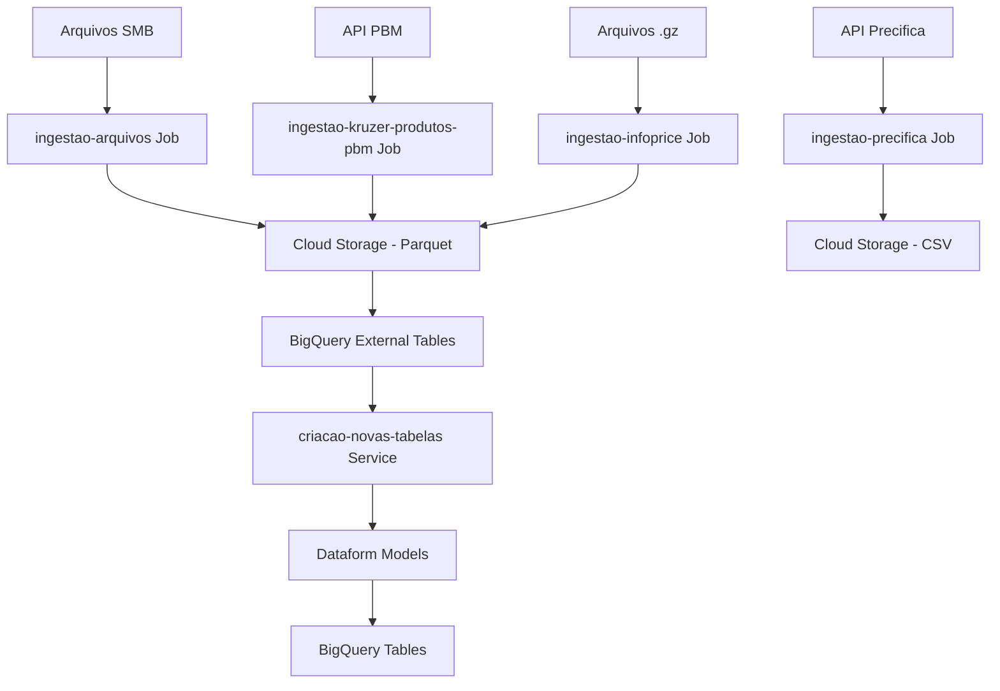

# Cloud Run Functions - GCP Data Pipeline

Este repositório contém um conjunto de **Cloud Run Services e Jobs** para processamento e ingestão de dados no Google Cloud Platform (GCP). As funções são responsáveis por diferentes etapas do pipeline de dados, desde a ingestão de arquivos até a geração automática de modelos do Dataform.

## 📁 Estrutura do Projeto

```
├── criacao-novas-tabelas/          # Cloud Run Service - Geração automática de modelos Dataform
├── ingestao-arquivos/              # Cloud Run Job - Processamento de arquivos Excel/CSV
├── ingestao-infoprice/             # Cloud Run Job - Conversão de arquivos InfoPrice
├── ingestao-kruzer-produtos-pbm/   # Cloud Run Job - Ingestão de dados PBM via API
├── ingestao-precifica/             # Cloud Run Job - Ingestão de dados Precifica via API
└── README.md
```

## 🚀 Cloud Run Services e Jobs

### 1. **Criação de Novas Tabelas** (`criacao-novas-tabelas/`)

**Tipo**: Cloud Run Service (HTTP)

**Função**: Geração automática de modelos Dataform para novas tabelas

**Descrição**: 
- Consulta tabelas pendentes no BigQuery
- Gera automaticamente arquivos `.sqlx` e `.js` do Dataform
- Cria branches no GitHub com as definições
- Suporta migrações INCREMENTAL e FULL
- Configura partições BigQuery automaticamente para tabelas incrementais

**Tecnologias**:
- Google Cloud BigQuery
- GitHub API
- SQLAlchemy (conexão com bancos de origem)
- Dataform

**Variáveis de Ambiente**:
```bash
GCP_PROJECT_ID=seu-projeto-gcp
GITHUB_TOKEN_SECRET_ID=github-token-secret
GITHUB_USER=usuario-github
GITHUB_REPO=repositorio-dataform
```

**Payload de Entrada**:
```json
{
  "config_table_id": "projeto.dataset.tabela_config"
}
```

---

### 2. **Ingestão de Arquivos** (`ingestao-arquivos/`)

**Tipo**: Cloud Run Job

**Função**: Processamento de arquivos Excel/CSV de compartilhamentos SMB

**Descrição**:
- Conecta a compartilhamentos SMB para buscar arquivos
- Processa diferentes tipos de arquivos (Excel, CSV, TXT)
- Aplica transformações específicas por tipo de arquivo
- Salva dados processados no Cloud Storage como Parquet
- Suporta modos de escrita: `overwrite` e `partitioned`

**Arquivos Suportados**:
- `Árvore MKT - Servicos.xlsx`
- `Info Lojas.xlsx`
- `Darks_Store_Lojas.xlsx`
- `Info Lojas Servicos Farmaceuticos.xlsx`
- `PRICEPOINT_CADASTRO PRODUTO_v2.xlsx`
- `Canal de Vendas.xlsx`
- `Redes_InfoPrice.xlsx`
- `Bairros_InfoPrice.xlsx`
- `Agenda_Sugestao_Compras.xlsx`
- `Expurgo_Pedidos_Compras.xlsx`
- `Expurgo_Mapas.xlsx`
- Arquivos IQVIA (`.txt`)

**Tecnologias**:
- Google Cloud Storage
- SMB Protocol
- Pandas
- PyArrow

**Variáveis de Ambiente**:
```bash
GCP_PROJECT=seu-projeto-gcp
PROCESSED_BUCKET=bucket-processado
SMB_SERVER_IP=10.0.1.100
SMB_SHARE_PATH=Arquivos Suporte PBI
FILE_TO_PROCESS=nome-do-arquivo.xlsx
```

---

### 3. **Ingestão InfoPrice** (`ingestao-infoprice/`)

**Tipo**: Cloud Run Job

**Função**: Conversão de arquivos InfoPrice de GZ para Parquet

**Descrição**:
- Processa arquivos `.gz` do Cloud Storage
- Converte dados para formato Parquet
- Aplica schema do BigQuery automaticamente
- Suporta triggers do GCS e execução manual via Airflow

**Tecnologias**:
- Google Cloud Storage
- Google Cloud BigQuery
- Pandas
- PyArrow

**Variáveis de Ambiente**:
```bash
BUCKET_NAME=bucket-origem
PREFIX=prefixo-arquivos
PROJECT_ID=seu-projeto-gcp
DATASET_BQ=dataset-destino
TABELA_BQ=tabela-destino
RUN=2024-01-01  # Opcional, para execução manual
```

**Triggers**:
- Cloud Storage (quando arquivo `.gz` é carregado)
- Airflow (execução manual com parâmetros)

---

### 4. **Ingestão Kruzer Produtos PBM** (`ingestao-kruzer-produtos-pbm/`)

**Tipo**: Cloud Run Job

**Função**: Ingestão de dados PBM via API HTTP

**Descrição**:
- Consulta API HTTP para obter dados PBM
- Aplica transformações específicas do domínio
- Salva dados como Parquet no Cloud Storage
- Implementa logging estruturado com Cloud Logging

**Tecnologias**:
- Requests (HTTP)
- Pandas
- PyArrow
- Google Cloud Storage
- Google Cloud Logging

**Variáveis de Ambiente**:
```bash
GCP_PROJECT=seu-projeto-gcp
BUCKET_NAME=bucket-destino
API_URL=https://api.exemplo.com/dados
FILE_NAME=nome-arquivo-saida
```

---

### 5. **Ingestão Precifica** (`ingestao-precifica/`)

**Tipo**: Cloud Run Job

**Função**: Ingestão de dados Precifica via API HTTP

**Descrição**:
- Consulta API HTTP para obter dados de produtos Precifica
- Processa dados de forma concorrente (múltiplas requisições simultâneas)
- Aplica transformações e normalizações específicas do domínio
- Adiciona colunas calculadas
- Salva dados como CSV no Cloud Storage

**Tecnologias**:
- Requests (HTTP)
- Pandas
- Google Cloud Storage
- ConfigParser (configuração)

**Variáveis de Ambiente**:
```bash
GCP_PROJECT=seu-projeto-gcp
API_BASE_URL=https://api.precifica.com
API_CLIENT_KEY=client-key
API_SECRET_KEY=secret-key
API_PLATAFORMA=plataforma
API_DOMINIO=dominio
GCS_BUCKET=bucket-destino
GCS_PREFIX=raw/precifica/
# Opcional: usar Secret Manager
GCP_SECRET_NAME=nome-do-secret
```

---

## 🛠️ Build e Deploy

### Pré-requisitos

1. **Google Cloud SDK** instalado e configurado
2. **Docker** para build das imagens
3. **Permissões IAM** adequadas no projeto GCP
4. **Secrets** configurados no Secret Manager
5. **Artifact Registry** ou **Container Registry** configurado

### Build e Push de Imagens Docker

Para cada projeto, você precisa fazer o build da imagem Docker e fazer push para o Artifact Registry/Container Registry:

```bash
# Configurar variáveis comuns
export PROJECT_ID=seu-projeto-gcp
export REGION=us-central1
export REPOSITORY=cloud-run-images  # Nome do repositório no Artifact Registry

# 1. Criação de Novas Tabelas
cd criacao-novas-tabelas
docker build -t gcr.io/${PROJECT_ID}/criacao-novas-tabelas:latest .
docker push gcr.io/${PROJECT_ID}/criacao-novas-tabelas:latest
# Ou usando Artifact Registry:
# docker build -t ${REGION}-docker.pkg.dev/${PROJECT_ID}/${REPOSITORY}/criacao-novas-tabelas:latest .
# docker push ${REGION}-docker.pkg.dev/${PROJECT_ID}/${REPOSITORY}/criacao-novas-tabelas:latest

# 2. Ingestão de Arquivos
cd ../ingestao-arquivos
docker build -t gcr.io/${PROJECT_ID}/ingestao-arquivos:latest .
docker push gcr.io/${PROJECT_ID}/ingestao-arquivos:latest

# 3. Ingestão InfoPrice
cd ../ingestao-infoprice
docker build -t gcr.io/${PROJECT_ID}/ingestao-infoprice:latest .
docker push gcr.io/${PROJECT_ID}/ingestao-infoprice:latest

# 4. Ingestão Kruzer Produtos PBM
cd ../ingestao-kruzer-produtos-pbm
docker build -t gcr.io/${PROJECT_ID}/ingestao-kruzer-produtos-pbm:latest .
docker push gcr.io/${PROJECT_ID}/ingestao-kruzer-produtos-pbm:latest

# 5. Ingestão Precifica
cd ../ingestao-precifica
docker build -t gcr.io/${PROJECT_ID}/ingestao-precifica:latest .
docker push gcr.io/${PROJECT_ID}/ingestao-precifica:latest
```

### Deploy/Atualização de Cloud Run Service

**Criação de Novas Tabelas** (Cloud Run Service):

```bash
cd criacao-novas-tabelas
gcloud run deploy criacao-novas-tabelas \
  --image gcr.io/${PROJECT_ID}/criacao-novas-tabelas:latest \
  --platform managed \
  --region us-central1 \
  --memory 2Gi \
  --timeout 900 \
  --set-env-vars GCP_PROJECT_ID=${PROJECT_ID} \
  --set-secrets GITHUB_TOKEN_SECRET_ID=github-token:latest
```

### Deploy/Atualização de Cloud Run Jobs

**Ingestão de Arquivos**:

```bash
cd ingestao-arquivos
gcloud run jobs update ingestao-arquivos \
  --image gcr.io/${PROJECT_ID}/ingestao-arquivos:latest \
  --region us-central1 \
  --memory 1Gi \
  --timeout 600 \
  --set-env-vars GCP_PROJECT=${PROJECT_ID},PROCESSED_BUCKET=bucket-processado,SMB_SERVER_IP=10.0.1.100,SMB_SHARE_PATH="Arquivos Suporte PBI" \
  --set-secrets SMB_USER=admin-bi-user:latest,SMB_PASSWORD=admin-bi-password:latest \
  --max-retries 1
```

**Ingestão InfoPrice**:

```bash
cd ingestao-infoprice
gcloud run jobs update ingestao-infoprice \
  --image gcr.io/${PROJECT_ID}/ingestao-infoprice:latest \
  --region us-central1 \
  --memory 1Gi \
  --timeout 600 \
  --set-env-vars BUCKET_NAME=bucket-origem,PREFIX=prefixo-arquivos,PROJECT_ID=${PROJECT_ID},DATASET_BQ=dataset-destino,TABELA_BQ=tabela-destino \
  --max-retries 1
```

**Ingestão Kruzer Produtos PBM**:

```bash
cd ingestao-kruzer-produtos-pbm
gcloud run jobs update ingestao-kruzer-produtos-pbm \
  --image gcr.io/${PROJECT_ID}/ingestao-kruzer-produtos-pbm:latest \
  --region us-central1 \
  --memory 512Mi \
  --timeout 300 \
  --set-env-vars GCP_PROJECT=${PROJECT_ID},BUCKET_NAME=bucket-destino,API_URL=https://api.exemplo.com/dados,FILE_NAME=nome-arquivo-saida \
  --max-retries 1
```

**Ingestão Precifica**:

```bash
cd ingestao-precifica
gcloud run jobs update ingestao-precifica \
  --image gcr.io/${PROJECT_ID}/ingestao-precifica:latest \
  --region us-central1 \
  --memory 1Gi \
  --timeout 600 \
  --set-env-vars GCP_PROJECT=${PROJECT_ID},GCS_BUCKET=bucket-destino,GCS_PREFIX=raw/precifica/ \
  --set-secrets API_CLIENT_KEY=precifica-client-key:latest,API_SECRET_KEY=precifica-secret-key:latest \
  --max-retries 1
```

**Nota**: Se for a primeira vez criando o job, use `gcloud run jobs create` ao invés de `update`.

## 🚀 Executar Cloud Run Jobs

### Chamar Cloud Run Jobs

Para executar um Cloud Run Job, você pode usar o comando `gcloud run jobs execute`:

```bash
# Executar Ingestão de Arquivos
gcloud run jobs execute ingestao-arquivos \
  --region us-central1 \
  --update-env-vars FILE_TO_PROCESS=nome-do-arquivo.xlsx

# Executar Ingestão InfoPrice
gcloud run jobs execute ingestao-infoprice \
  --region us-central1 \
  --update-env-vars RUN=2024-01-01

# Executar Ingestão Kruzer Produtos PBM
gcloud run jobs execute ingestao-kruzer-produtos-pbm \
  --region us-central1

# Executar Ingestão Precifica
gcloud run jobs execute ingestao-precifica \
  --region us-central1
```

### Chamar Cloud Run Service (HTTP)

Para chamar o Cloud Run Service **Criação de Novas Tabelas**, faça uma requisição HTTP:

```bash
# Obter a URL do serviço
SERVICE_URL=$(gcloud run services describe criacao-novas-tabelas \
  --region us-central1 \
  --format 'value(status.url)')

# Fazer requisição POST
curl -X POST ${SERVICE_URL} \
  -H "Authorization: Bearer $(gcloud auth print-identity-token)" \
  -H "Content-Type: application/json" \
  -d '{"config_table_id": "projeto.dataset.tabela_config"}'
```

Ou usando o gcloud:

```bash
gcloud run services call criacao-novas-tabelas \
  --region us-central1 \
  --data '{"config_table_id": "projeto.dataset.tabela_config"}'
```

### Monitorar Execução de Jobs

```bash
# Listar execuções de um job
gcloud run jobs executions list \
  --job ingestao-arquivos \
  --region us-central1

# Ver logs de uma execução específica
gcloud run jobs executions describe EXECUTION_NAME \
  --job ingestao-arquivos \
  --region us-central1

# Ver logs em tempo real
gcloud logging tail "resource.type=cloud_run_job AND resource.labels.job_name=ingestao-arquivos"
```

## 🔐 Configuração de Secrets

```bash
# GitHub Token
gcloud secrets create github-token --data-file=github-token.txt

# Credenciais SMB
gcloud secrets create admin-bi-user --data-file=smb-user.txt
gcloud secrets create admin-bi-password --data-file=smb-password.txt

# Outros secrets conforme necessário
```

## 📊 Fluxo de Dados



## 🔧 Desenvolvimento Local

### Pré-requisitos para Teste Local

1. **Python 3.10+** instalado
2. **Virtual Environment** (venv) configurado
3. **Google Cloud SDK** instalado e autenticado (`gcloud auth application-default login`)
4. **Variáveis de ambiente** configuradas (via `.env` ou export)
5. **Secrets** do GCP acessíveis (via Application Default Credentials)

### Testes Locais

#### 1. Criação de Novas Tabelas

```bash
# Entrar na pasta do projeto
cd criacao-novas-tabelas

# Criar e ativar venv (se ainda não tiver)
python -m venv venv
# Windows:
venv\Scripts\activate
# Linux/Mac:
source venv/bin/activate

# Instalar dependências
pip install -r requirements.txt

# Configurar variáveis de ambiente (criar arquivo .env ou export)
export GCP_PROJECT_ID=seu-projeto-gcp
export GITHUB_TOKEN_SECRET_ID=github-token-secret
export GITHUB_USER=usuario-github
export GITHUB_REPO=repositorio-dataform

# Executar localmente (simula requisição HTTP)
python main.py
# Ou usando Functions Framework para testar como HTTP service:
functions-framework --target=main --port=8080
# Em outro terminal, fazer requisição:
curl -X POST http://localhost:8080 \
  -H "Content-Type: application/json" \
  -d '{"config_table_id": "projeto.dataset.tabela_config"}'
```

#### 2. Ingestão de Arquivos

```bash
# Entrar na pasta do projeto
cd ingestao-arquivos

# Criar e ativar venv
python -m venv venv
# Windows:
venv\Scripts\activate
# Linux/Mac:
source venv/bin/activate

# Instalar dependências
pip install -r requirements.txt

# Configurar variáveis de ambiente
export GCP_PROJECT=seu-projeto-gcp
export PROCESSED_BUCKET=bucket-processado
export SMB_SERVER_IP=10.0.1.100
export SMB_SHARE_PATH=Arquivos Suporte PBI
export FILE_TO_PROCESS=nome-do-arquivo.xlsx

# Executar localmente
python main.py
```

#### 3. Ingestão InfoPrice

```bash
# Entrar na pasta do projeto
cd ingestao-infoprice

# Criar e ativar venv
python -m venv venv
# Windows:
venv\Scripts\activate
# Linux/Mac:
source venv/bin/activate

# Instalar dependências
pip install -r requirements.txt

# Configurar variáveis de ambiente
export BUCKET_NAME=bucket-origem
export PREFIX=prefixo-arquivos
export PROJECT_ID=seu-projeto-gcp
export DATASET_BQ=dataset-destino
export TABELA_BQ=tabela-destino
export RUN=2024-01-01  # Opcional

# Executar localmente
python main.py
```

#### 4. Ingestão Kruzer Produtos PBM

```bash
# Entrar na pasta do projeto
cd ingestao-kruzer-produtos-pbm

# Criar e ativar venv
python -m venv venv
# Windows:
venv\Scripts\activate
# Linux/Mac:
source venv/bin/activate

# Instalar dependências
pip install -r requirements.txt

# Configurar variáveis de ambiente
export GCP_PROJECT=seu-projeto-gcp
export BUCKET_NAME=bucket-destino
export API_URL=https://api.exemplo.com/dados
export FILE_NAME=nome-arquivo-saida

# Executar localmente
python main.py
```

#### 5. Ingestão Precifica

```bash
# Entrar na pasta do projeto
cd ingestao-precifica

# Criar e ativar venv
python -m venv venv
# Windows:
venv\Scripts\activate
# Linux/Mac:
source venv/bin/activate

# Instalar dependências
pip install -r requirements.txt

# Configurar variáveis de ambiente
export GCP_PROJECT=seu-projeto-gcp
export API_BASE_URL=https://api.precifica.com
export API_CLIENT_KEY=client-key
export API_SECRET_KEY=secret-key
export API_PLATAFORMA=plataforma
export API_DOMINIO=dominio
export GCS_BUCKET=bucket-destino
export GCS_PREFIX=raw/precifica/

# Executar localmente
python main.py
```

## 📝 Logs e Monitoramento

- **Cloud Logging**: Todas as funções utilizam Cloud Logging para logs estruturados
- **Cloud Monitoring**: Métricas automáticas de execução, latência e erros
- **Error Reporting**: Captura automática de exceções não tratadas

## 🔒 Segurança

- **Secret Manager**: Credenciais sensíveis armazenadas de forma segura
- **IAM**: Permissões mínimas necessárias para cada função
- **VPC**: Conexões seguras com recursos internos quando necessário
- **Audit Logs**: Logs de auditoria habilitados para todas as operações

## 📈 Escalabilidade

- **Auto-scaling**: Cloud Run escala automaticamente baseado na demanda
- **Concurrency**: Configuração de concorrência por instância
- **Memory/CPU**: Recursos ajustáveis por função conforme necessidade
- **Timeout**: Timeouts configurados adequadamente para cada tipo de processamento

## 🚨 Troubleshooting

### Problemas Comuns

1. **Timeout de execução**: Aumente o timeout da função
2. **Memória insuficiente**: Ajuste a memória alocada
3. **Erro de permissões**: Verifique as permissões IAM
4. **Falha na conexão SMB**: Verifique credenciais e conectividade de rede

### Logs Úteis

```bash
# Visualizar logs de uma função específica
gcloud logging read "resource.type=cloud_run_revision AND resource.labels.service_name=ingestao-arquivos" --limit=50

# Logs de erro
gcloud logging read "severity>=ERROR" --limit=20
```

## 📞 Suporte

Para questões técnicas ou problemas com as funções, consulte:
- Logs no Cloud Logging
- Métricas no Cloud Monitoring
- Documentação do Google Cloud Run
- Issues do repositório
