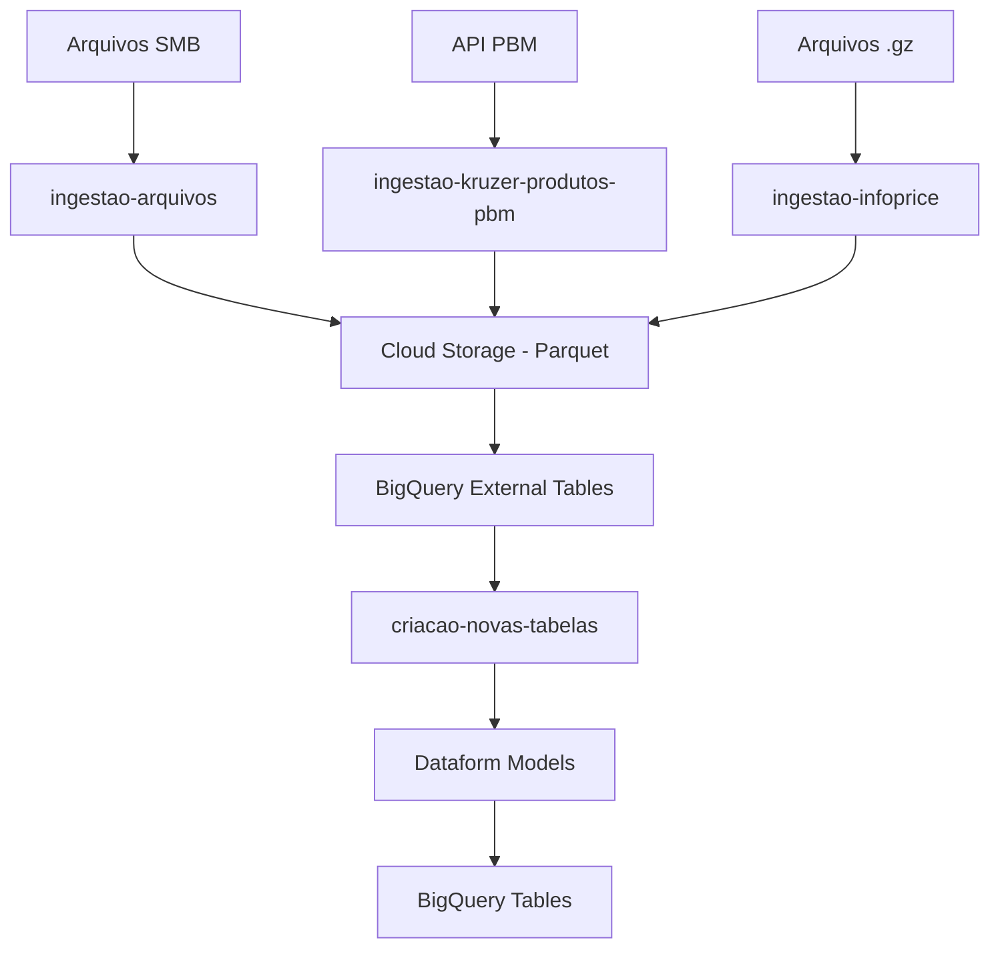

# Cloud Run Functions - GCP Data Pipeline

Este repositório contém um conjunto de **Cloud Run Functions** para processamento e ingestão de dados no Google Cloud Platform (GCP). As funções são responsáveis por diferentes etapas do pipeline de dados, desde a ingestão de arquivos até a geração automática de modelos do Dataform.

## 📁 Estrutura do Projeto

```
├── criacao-novas-tabelas/          # Geração automática de modelos Dataform
├── ingestao-arquivos/              # Processamento de arquivos Excel/CSV
├── ingestao-infoprice/             # Conversão de arquivos InfoPrice
├── ingestao-kruzer-produtos-pbm/   # Ingestão de dados PBM via API
└── README.md
```

## 🚀 Cloud Run Functions

### 1. **Criação de Novas Tabelas** (`criacao-novas-tabelas/`)

**Função**: Geração automática de modelos Dataform para novas tabelas

**Descrição**: 
- Consulta tabelas pendentes no BigQuery
- Gera automaticamente arquivos `.sqlx` e `.js` do Dataform
- Cria branches no GitHub com as definições
- Suporta migrações INCREMENTAL e FULL
- Configura partições BigQuery automaticamente para tabelas incrementais

**Tecnologias**:
- Google Cloud BigQuery
- GitHub API
- SQLAlchemy (conexão com bancos de origem)
- Dataform

**Variáveis de Ambiente**:
```bash
GCP_PROJECT_ID=seu-projeto-gcp
GITHUB_TOKEN_SECRET_ID=github-token-secret
GITHUB_USER=usuario-github
GITHUB_REPO=repositorio-dataform
```

**Payload de Entrada**:
```json
{
  "config_table_id": "projeto.dataset.tabela_config"
}
```

---

### 2. **Ingestão de Arquivos** (`ingestao-arquivos/`)

**Função**: Processamento de arquivos Excel/CSV de compartilhamentos SMB

**Descrição**:
- Conecta a compartilhamentos SMB para buscar arquivos
- Processa diferentes tipos de arquivos (Excel, CSV, TXT)
- Aplica transformações específicas por tipo de arquivo
- Salva dados processados no Cloud Storage como Parquet
- Suporta modos de escrita: `overwrite` e `partitioned`

**Arquivos Suportados**:
- `Árvore MKT - Servicos.xlsx`
- `Info Lojas.xlsx`
- `Darks_Store_Lojas.xlsx`
- `Info Lojas Servicos Farmaceuticos.xlsx`
- `PRICEPOINT_CADASTRO PRODUTO_v2.xlsx`
- `Canal de Vendas.xlsx`
- `Redes_InfoPrice.xlsx`
- `Bairros_InfoPrice.xlsx`
- Arquivos IQVIA (`.txt`)

**Tecnologias**:
- Google Cloud Storage
- SMB Protocol
- Pandas
- PyArrow

**Variáveis de Ambiente**:
```bash
GCP_PROJECT=seu-projeto-gcp
PROCESSED_BUCKET=bucket-processado
SMB_SERVER_IP=10.0.1.100
SMB_SHARE_PATH=Arquivos Suporte PBI
FILE_TO_PROCESS=nome-do-arquivo.xlsx
```

---

### 3. **Ingestão InfoPrice** (`ingestao-infoprice/`)

**Função**: Conversão de arquivos InfoPrice de GZ para Parquet

**Descrição**:
- Processa arquivos `.gz` do Cloud Storage
- Converte dados para formato Parquet
- Aplica schema do BigQuery automaticamente
- Suporta triggers do GCS e execução manual via Airflow

**Tecnologias**:
- Google Cloud Storage
- Google Cloud BigQuery
- Pandas
- PyArrow

**Variáveis de Ambiente**:
```bash
BUCKET_NAME=bucket-origem
PREFIX=prefixo-arquivos
PROJECT_ID=seu-projeto-gcp
DATASET_BQ=dataset-destino
TABELA_BQ=tabela-destino
RUN=2024-01-01  # Opcional, para execução manual
```

**Triggers**:
- Cloud Storage (quando arquivo `.gz` é carregado)
- Airflow (execução manual com parâmetros)

---

### 4. **Ingestão Kruzer Produtos PBM** (`ingestao-kruzer-produtos-pbm/`)

**Função**: Ingestão de dados PBM via API HTTP

**Descrição**:
- Consulta API HTTP para obter dados PBM
- Aplica transformações específicas do domínio
- Salva dados como Parquet no Cloud Storage
- Implementa logging estruturado com Cloud Logging

**Tecnologias**:
- Requests (HTTP)
- Pandas
- PyArrow
- Google Cloud Storage
- Google Cloud Logging

**Variáveis de Ambiente**:
```bash
GCP_PROJECT=seu-projeto-gcp
BUCKET_NAME=bucket-destino
API_URL=https://api.exemplo.com/dados
FILE_NAME=nome-arquivo-saida
```

---

## 🛠️ Configuração e Deploy

### Pré-requisitos

1. **Google Cloud SDK** instalado e configurado
2. **Docker** para build das imagens
3. **Permissões IAM** adequadas no projeto GCP
4. **Secrets** configurados no Secret Manager

### Deploy das Funções

```bash
# Para cada função, navegue até o diretório e execute:

# 1. Criação de Novas Tabelas
cd criacao-novas-tabelas
gcloud run deploy criacao-novas-tabelas \
  --source . \
  --platform managed \
  --region us-central1 \
  --memory 2Gi \
  --timeout 900 \
  --set-env-vars GCP_PROJECT_ID=seu-projeto

# 2. Ingestão de Arquivos
cd ../ingestao-arquivos
gcloud run deploy ingestao-arquivos \
  --source . \
  --platform managed \
  --region us-central1 \
  --memory 1Gi \
  --timeout 600

# 3. Ingestão InfoPrice
cd ../ingestao-infoprice
gcloud run deploy ingestao-infoprice \
  --source . \
  --platform managed \
  --region us-central1 \
  --memory 1Gi \
  --timeout 600

# 4. Ingestão Kruzer PBM
cd ../ingestao-kruzer-produtos-pbm
gcloud run deploy ingestao-kruzer-pbm \
  --source . \
  --platform managed \
  --region us-central1 \
  --memory 512Mi \
  --timeout 300
```

### Configuração de Secrets

```bash
# GitHub Token
gcloud secrets create github-token --data-file=github-token.txt

# Credenciais SMB
gcloud secrets create admin-bi-user --data-file=smb-user.txt
gcloud secrets create admin-bi-password --data-file=smb-password.txt

# Outros secrets conforme necessário
```

## 📊 Fluxo de Dados



## 🔧 Desenvolvimento Local

### Setup do Ambiente

```bash
# Clone o repositório
git clone <repo-url>
cd cloud-run-functions

# Para cada função, instale as dependências
cd criacao-novas-tabelas
pip install -r requirements.txt

# Configure as variáveis de ambiente
cp .env.example .env
# Edite o .env com suas configurações
```

### Testes Locais

```bash
# Teste individual de cada função
cd criacao-novas-tabelas
python main.py

# Ou usando o Functions Framework
functions-framework --target=main --source=main.py --port=8080
```

## 📝 Logs e Monitoramento

- **Cloud Logging**: Todas as funções utilizam Cloud Logging para logs estruturados
- **Cloud Monitoring**: Métricas automáticas de execução, latência e erros
- **Error Reporting**: Captura automática de exceções não tratadas

## 🔒 Segurança

- **Secret Manager**: Credenciais sensíveis armazenadas de forma segura
- **IAM**: Permissões mínimas necessárias para cada função
- **VPC**: Conexões seguras com recursos internos quando necessário
- **Audit Logs**: Logs de auditoria habilitados para todas as operações

## 📈 Escalabilidade

- **Auto-scaling**: Cloud Run escala automaticamente baseado na demanda
- **Concurrency**: Configuração de concorrência por instância
- **Memory/CPU**: Recursos ajustáveis por função conforme necessidade
- **Timeout**: Timeouts configurados adequadamente para cada tipo de processamento

## 🚨 Troubleshooting

### Problemas Comuns

1. **Timeout de execução**: Aumente o timeout da função
2. **Memória insuficiente**: Ajuste a memória alocada
3. **Erro de permissões**: Verifique as permissões IAM
4. **Falha na conexão SMB**: Verifique credenciais e conectividade de rede

### Logs Úteis

```bash
# Visualizar logs de uma função específica
gcloud logging read "resource.type=cloud_run_revision AND resource.labels.service_name=ingestao-arquivos" --limit=50

# Logs de erro
gcloud logging read "severity>=ERROR" --limit=20
```

## 📞 Suporte

Para questões técnicas ou problemas com as funções, consulte:
- Logs no Cloud Logging
- Métricas no Cloud Monitoring
- Documentação do Google Cloud Run
- Issues do repositório

---

**Última atualização**: Janeiro 2024  
**Versão**: 1.0.0
